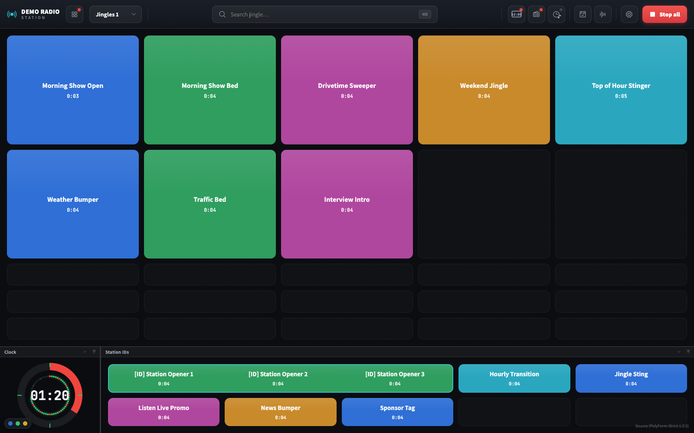
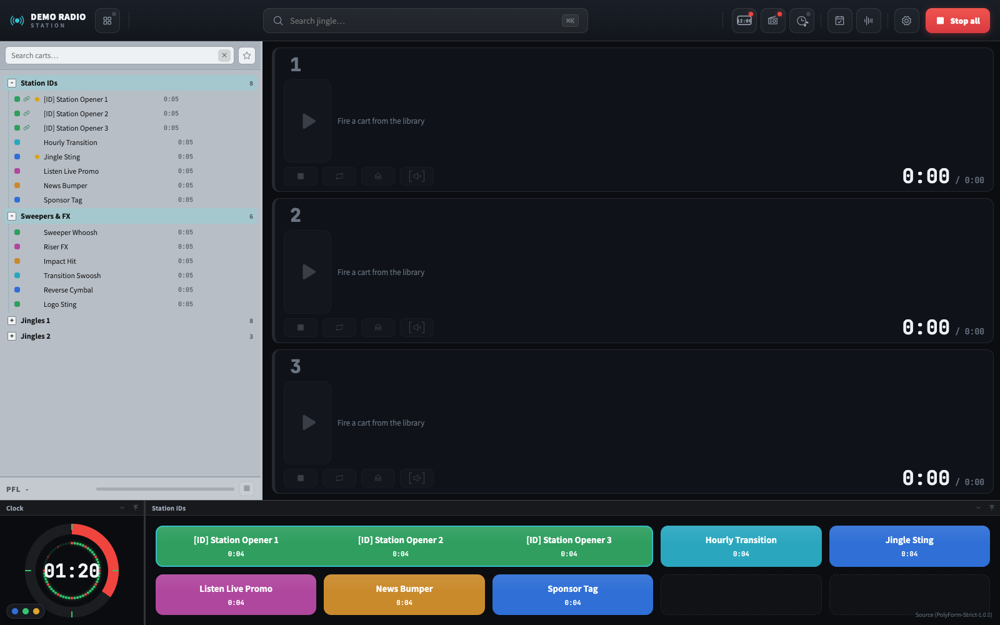
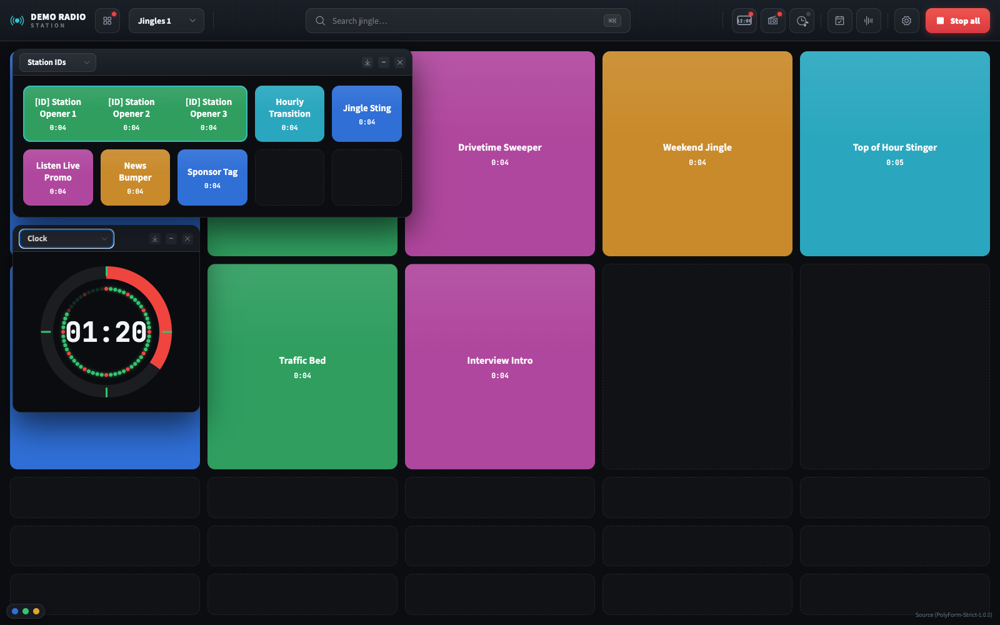
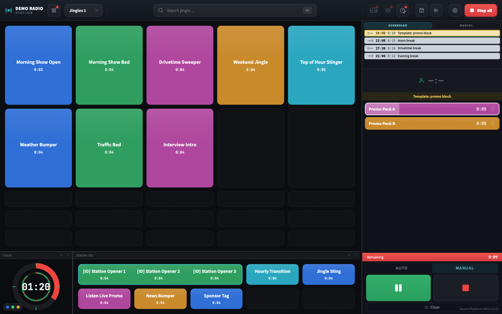
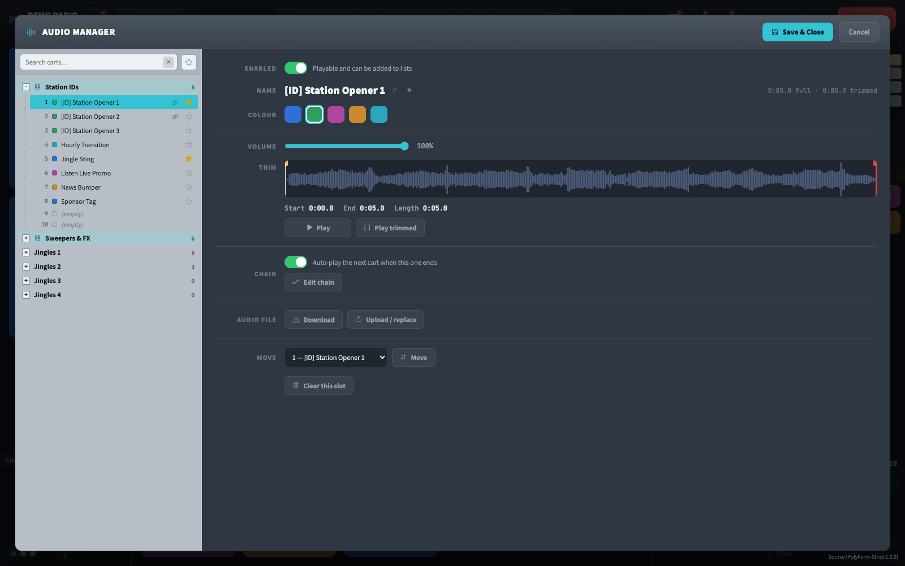
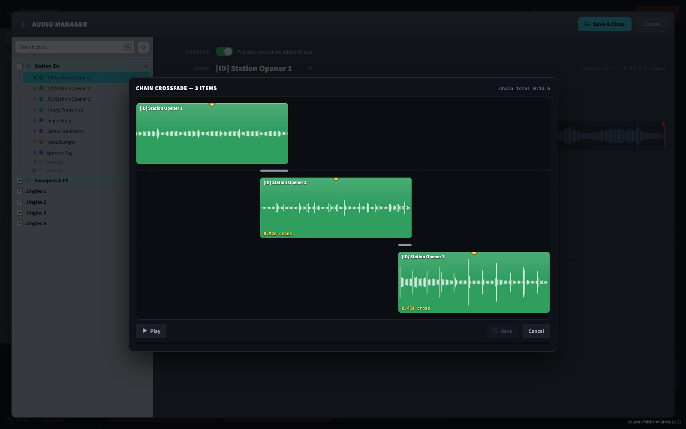
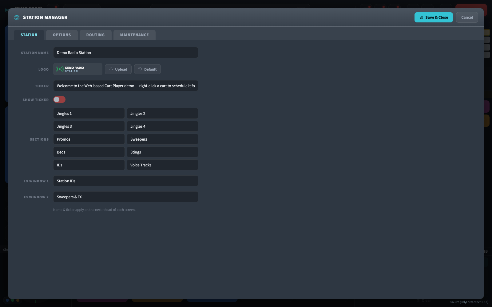
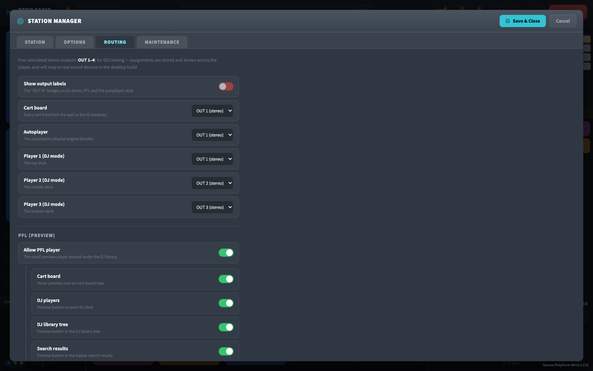

# Web-based Cart Player

[](LICENSE)

A browser-based **cart wall** (a.k.a. jingle / sound-effect playout panel) for live radio,
built with plain PHP and vanilla JavaScript — no framework, no database server. It runs the
on-air jingles, station IDs, sweepers and promos for a live station from a grid of clickable
buttons, plus a DJ mode, a scheduled autoplayer, and full admin tooling — and has been used
daily in production.

This repository is a **cleaned-up, de-branded demo** of that system, shared **source-available**
for personal/noncommercial evaluation — see [License](#license) below before deploying it
anywhere real. The audio, content and credentials are sample data.

> **Demo logins** — Admin: `admin` / `admin` · DJ: `dj` / `dj`
> (defined in [`config.php`](config.php); change them before any real deployment).

---

## Features

- **Cart wall** — a paginated grid of colour-coded buttons; click to play, click to stop.
- **DJ mode** — a searchable library tree next to up to three independent manual decks, each
  routable to its own simulated output.
- **Sections** — the flat cart list is sliced into named sections (Station IDs, Jingles, Promos…).
- **Chaining + chain crossfades** — link carts to play back-to-back as one run, with a per-junction
  crossfade editor and a single shared "fire the whole run" control.
- **PFL (preview / pre-fade listen)** — preview any cart in isolation — from the board, a DJ deck,
  the library tree, or search results — without touching what's actually on air.
- **Trimming** — set per-cart start/end points on a waveform (wavesurfer.js), drafted live and
  committed together with the rest of a cart's edits.
- **Break Planner + Autoplayer** — schedule recurring daily breaks (commercial blocks, station
  IDs) that fire automatically at a wall-clock time, or load and fire them by hand; a runtime
  strip always shows what's coming up next.
- **Routing** — assign the board, the autoplayer, each DJ deck, and the PFL bus to one of four
  simulated stereo outputs (maps to real sound devices in a future desktop build).
- **Floating windows** — a Station-ID panel and a broadcast clock, each dockable/undockable,
  resizable, and minimizable.
- **Keep-alive heartbeat** — keeps the audio device warm so the first jingle is never late.
- **Mobile access** — a QR code opens a touch-friendly section view on a phone.
- **Search** — a command-palette-style search across every cart that jumps to and flashes the result.
- **Admin tooling** — a Station Manager (branding, feature toggles, routing, backup/restore, and
  logs with configurable retention) plus a dedicated Audio Library Manager for per-cart editing.
- **Two roles** — full `admin` and a limited `dj` view.

---

## Screenshots

**Carts mode** — the paginated board, with the Clock and Station IDs docked at the bottom.


**DJ mode** — a searchable library tree (with favourites and chain awareness) next to up to
three independent manual decks and a PFL preview bar.


**Floating windows** — the Clock and Station IDs undocked from the bottom bar, each an
independently draggable, resizable, minimizable window over the board.


**Autoplayer** — a scheduled break loaded and actively playing, with a live remaining-time bar
and the upcoming schedule visible above it.


**Audio library manager** — per-cart detail: enable/rename/colour/volume, an inline waveform trimmer,
chaining (with its own crossfade editor), move, and file replace.


**Chain crossfade editor** — one lane per item in a chain, each with a draggable fade-in handle and
a live cross-time readout; Play auditions the whole chain through the crossfades.


**Settings — Station tab** — name, logo, ticker, section labels, and the two floating ID-window names.


**Settings — Routing tab** — assign the board, the autoplayer, each DJ deck, and the PFL preview
bus to one of four simulated outputs (will be tested on real multitrack audio devices soon).


---

## How it works

```
index.php  ── the player shell (Carts mode OR DJ mode) ───────────────────────┐
   ├─ <iframe> grid.php?from=10&to=75   → the main cart wall (Carts mode)       │
   ├─ <iframe> grid.php?from=0&to=10    → floating "Station ID" window          │
   ├─ <iframe> clock.php                → floating broadcast clock              │
   ├─ <iframe> keep-alive.php           → heartbeat (silent audio + indicator)   │
   ├─ assets/js/dj.js                   → DJ mode: library tree + manual decks   │
   ├─ assets/js/automation.js           → Autoplayer engine + breaks strip       │
   ├─ assets/js/manager.js              → Station Manager overlay               │
   ├─ assets/js/audio-manager.js        → Audio Library Manager overlay         │
   └─ assets/js/planner.js              → Break Planner overlay                 │
                                                                                │
grid.php  ── cart-wall shell ── loads assets/js/cartwall.js (the board engine) ─┘

data/*.txt   the "pseudo-database" (flat files)        uploads/*.mp3   the audio
```

- **`config.php`** is the single source of truth: station name, demo credentials, paths,
  section sizing and the button colour palette.
- **`auth.php`** provides the `admin` / `dj` session guards.
- **`includes/helpers.php`** wraps every flat-file read/write (`load_carts()`, `load_breaks()`,
  `load_routing()`, `color_for()`, …) so the format lives in one place.

### The audio load mechanism (the "preload hack")

This is the trick that makes the player usable on air, and it lives in
[`assets/js/cartwall.js`](assets/js/cartwall.js).

Browsers don't actually decode an `<audio>` element's data until something forces them to, so a
cold first `play()` often has audible latency or a clipped attack — unacceptable for a jingle.
To avoid that, each clip is **primed** as the wall loads: it is played once **muted** (`volume = 0`)
and immediately paused, at a small **staggered delay** so the browser isn't asked to decode every
file in the same instant. If a clip reports that it never really started, it is retried a few times
with a growing delay. After this pass the first real click is instant and clean.

> **⚠️ Autoplay policy — required for the preload to work.** The preload calls `audio.play()`
> programmatically, and modern browsers **block audio playback until the user has interacted with
> the page** (a click, etc.). On a normal browser the carts therefore won't prime until your first
> click. A dedicated playout machine should run the browser with that gate disabled — for Chrome/Chromium:
> ```
> chrome --autoplay-policy=no-user-gesture-required
> ```
> (typically combined with `--kiosk`). With that flag the wall primes every cart the moment it loads,
> exactly like the production setup. The future kiosk app will set this automatically.

### The keep-alive heartbeat

See [`assets/js/keep-alive.js`](assets/js/keep-alive.js). A playout machine often sits idle for long
stretches; the OS/browser will then let the audio output go to sleep, which adds a delay the next
time a jingle fires. The heartbeat plays a **near-silent clip at 1% volume every 30 seconds** to keep
the audio device awake. It doubles as a connection monitor: each beat is logged and a colour-coded
dot shows online (green) / offline (red).

### Data model

Everything lives in flat, pipe-separated text files under `data/` — no database server, no ORM.
Every reader tolerates missing or short files (falling back to sane defaults), so a fresh checkout
with an empty `data/` directory still boots.

| File | Format | Notes |
|------|--------|-------|
| `carts.txt` | `name\|file\|startSec\|colour(1-5)\|endSec\|volume` per line, one line per board slot | `volume` (0–1) is optional and defaults to 1. An empty slot is `- \|0.mp3\|0\|1`. A line's 1-based number is the cart's id everywhere else (breaks, favourites, chains). |
| `cross.txt` | `flag` or `flag\|fadeMs` per line, aligned 1:1 with `carts.txt` | `flag=1` means "auto-play the next cart when this one ends" (chaining). The optional `fadeMs` is the chain-crossfade editor's overlap — the *next* cart launches that many ms before this one ends. |
| `enabled.txt` | `1`/`0` per line, aligned with `carts.txt` | A disabled cart is darkened and excluded from search, the planner tree, the DJ library, and playback everywhere. Missing = enabled. |
| `favorites.txt` | one 1-based cart id per line | A station-wide "starred" list, shared by the planner tree, the DJ library and the Audio Library Manager. |
| `routing.txt` | `key\|out` per line | Which of 4 **simulated** stereo outputs (`OUT 1`–`4`) each source feeds: `player1`/`player2`/`player3` (DJ decks), `pfl` (preview bus), `carts` (board), `autoplayer`, and `manager_preview` (0–4, where `0` means "the PFL bus" — used by the Audio Library Manager's chain-editor Play button). GUI-level only until a future desktop build maps these to real sound devices. |
| `settings.txt` | `key\|value` per line | Feature toggles — see the full key list below. |
| `breaks.txt` | `HH:MM\|anchor\|name\|itemIds\|enabled\|trigger\|overlaps\|volumes` per line | The Break Planner / Autoplayer's schedule — see **Breaks** below. |
| `id-sections.txt` | 2 lines, plain text | Display names for the two floating ID-window sections (defaults: "Station IDs", "Sweepers & FX"). |
| `station.txt` | 1 line, plain text | Station name override (falls back to the `STATION_NAME` constant in `config.php`). |
| `status.txt` | 1 line, plain text | The scrolling ticker message shown in the footer. |
| `parts.txt` | up to 10 lines, plain text | Editable labels for the board's page/section slots. |
| `credits/day1.txt` … `day7.txt` | one name per line | Daily on-air credits, shown by `credits.php`. |

Two more files exist on disk — `page_names.txt` and `dj-rights.txt` — but are legacy holdovers
from an earlier admin-panel generation: nothing in the current UI reads them, they're kept only so
`backup.php`'s full-snapshot restore round-trips cleanly with older backups.

**Settings keys** (`data/settings.txt`) — all are UI-level toggles, nothing deeper:

| Key | Meaning |
|-----|---------|
| `mobile` | Mobile-access (QR) button |
| `download` | Bulk audio download button |
| `automation` | Automation playlist + Break Planner |
| `ids_window` | Station-ID / sweepers floating window |
| `dj_mode` | The Carts/DJ layout toggle |
| `dj_players` | How many of the 3 DJ decks are shown (1–3) |
| `pfl_player` | The small PFL (preview) mini-player docked under the DJ library |
| `pfl_buttons_carts` / `pfl_buttons_players` / `pfl_buttons_tree` / `pfl_buttons_search` | Per-surface PFL preview buttons (board tiles, DJ decks, DJ library tree, topbar search) |
| `show_out_labels` | The "OUT N" output badges on DJ decks, PFL and the autoplayer |
| `show_ticker` | Scrolling status message in the footer |
| `dock_resize` | Allow dragging the bottom dock's height |
| `panel_resize` | Allow widening the DJ library tree / automation sidebar |
| `log_retention` | Days of keep-alive/playback log history to keep (30/60/90/180, `0` = forever) |

**Breaks** (`data/breaks.txt`) power both the Break Planner (admin overlay) and the runtime
Autoplayer strip. Each line is one break:

- **`HH:MM`** — 24-hour wall-clock anchor time; repeats daily.
- **`anchor`** — `start` (begins at `HH:MM`) or `end` (must *end* by `HH:MM`).
- **`name`** — free-text chip label.
- **`itemIds`** — comma-separated 1-based `carts.txt` line numbers. These are **references**,
  resolved against the live cart data (including trims) at play/calc time, never snapshots — so
  re-trimming a cart updates every break that uses it.
- **`enabled`** — `1`/`0`; disabled breaks are planner-only "parking" (templates, holiday specials)
  and never shown to the player.
- **`trigger`** — `auto` (fires on schedule) or `manual` (a DJ loads and fires it by hand).
- **`overlaps`** — comma-separated ms values, one per *gap* between items (count = items − 1): the
  next item launches that many ms before the previous one ends (the planner's crossfade editor).
- **`volumes`** — comma-separated per-item volume overrides (0–1, two decimals); `-1` means "use
  the cart's own volume".

---

## Running it locally

Requires PHP 7.4+ (8.x recommended). From the project root:

```bash
php -S localhost:8000
```

Then open <http://localhost:8000/index.php>. Sign in at `/login.php` with the demo credentials
above. The `data/` and `uploads/` folders must be writable by the web server.

For the cart **preload** to prime without a first click, launch the browser with autoplay allowed
(see the autoplay note above), e.g.:

```bash
# macOS example
open -a "Google Chrome" --args --autoplay-policy=no-user-gesture-required http://localhost:8000/index.php
```

> Tip: regenerate the QR code (`assets/img/qr.png`) to point at your own deployment's
> `mobile.php` URL so phones on your network can scan it.

## Deploying

Copy the folder onto any PHP-capable web host (Apache, nginx + php-fpm, shared hosting, …) and make
sure `data/` and `uploads/` are writable. There is no build step and no database to provision.

**Before going live:** change the credentials in `config.php` (and ideally switch to hashed
passwords), restrict access to the admin endpoints, and re-read the [License](#license) section —
this repo is source-available for personal/noncommercial evaluation, not for commercial deployment
or redistribution.

### Runs fully offline (no internet / LAN-only)

Every third-party asset is **self-hosted** under `assets/` — nothing is loaded from a CDN or
Google Fonts at runtime — so the player works on an isolated network with no internet access
(the intended studio / kiosk deployment). Bundled, pinned:

| Asset | Version | Where | License |
|-------|---------|-------|---------|
| Assistant + JetBrains Mono (woff2) | — | `assets/fonts/` (license text: `assets/fonts/OFL.txt`) | SIL OFL 1.1 |
| Phosphor Icons (regular + fill) | 2.1.1 | `assets/vendor/phosphor/` (license text: `assets/vendor/phosphor/LICENSE`) | MIT |
| wavesurfer.js (waveform trimmers) | 6.6.4 | `assets/vendor/` (license text: `assets/vendor/LICENSE-wavesurfer.txt`) | BSD-3-Clause |
| Chart.js (usage graph) | 4.4.1 | `assets/vendor/` (license text: `assets/vendor/LICENSE-chartjs.txt`) | MIT |

To refresh a bundled asset, re-download the pinned version into the same path — no reference
changes needed.

---

## Project structure

```
config.php                  branding, demo credentials, paths, colours
auth.php                     session-based admin/dj guards
includes/helpers.php         flat-file data helpers

index.php                    player shell — Carts/DJ mode + the Station Manager, Audio Library
                              Manager and Break Planner overlays (all driven by assets/js/*.js below)
grid.php                     the cart wall itself (the board, and the floating ID window)

assets/js/cartwall.js        board engine — preload hack, chaining, back-timer, PFL
assets/js/dj.js               DJ mode — library tree + manual decks
assets/js/automation.js      Autoplayer engine, breaks strip, and the planner-mode API
assets/js/manager.js         Station Manager overlay (Station / Options / Audio / Maintenance)
assets/js/audio-manager.js   Audio Library Manager overlay (per-cart editing + chain crossfades)
assets/js/planner.js         Break Planner overlay
assets/js/keep-alive.js      the heartbeat

login.php / logout.php       auth                       search.php        topbar search
mobile.php                   QR landing page             keep-alive.php    heartbeat endpoint
save-*.php                   JSON endpoints the modern JS UI posts to (cart/routing/settings/…)

admin.php / dj.php           legacy management screens that pre-date the overlays above; still
                              linked as a fallback ("Legacy admin panel"), superseded for daily use
trimmer*.php, color*.php,    the legacy panels' own supporting endpoints (see QA-CHECKLIST.md /
add.php, rename.php, …       the backlog notes for exactly which ones are still reachable)
maintenance*.php              legacy standalone logs/cleanup/backup/usage-chart pages

assets/css|js|img|vendor|fonts   styles, the JS engine, logo/QR, bundled fonts + libraries
data/                         the pseudo-database (sample content)
uploads/                      audio (short demo clips)
docs/screenshots/             the images used in this README
QA-CHECKLIST.md               manual test checklist, organised by feature area
```

## License

Source-available under the **[PolyForm Strict License 1.0.0](https://polyformproject.org/licenses/strict/1.0.0)**.
See [LICENSE](LICENSE) for the full text; the short version:

- **Noncommercial and personal use is permitted** — running it for research, hobby projects,
  a noncommercial station, education, or evaluation is fine.
- **Commercial use is not permitted** without a separate license from the copyright holder.
- **You may not redistribute this software** — no republishing, re-hosting, or forking it
  onward to anyone else, modified or not.
- Comes with **no warranty** of any kind.

Copyright © 2024-2026 Omer Senesh.

Third-party assets bundled under `assets/` keep their own separate, more permissive licenses
(SIL OFL 1.1, MIT, BSD-3-Clause — see the table above and the `LICENSE`/`OFL.txt` files next to
each one); none of that changes the terms above for the rest of the code.

Originally built as a JS + PHP patchwork for a live community radio station and refactored into
this presentable, source-available portfolio project.
